I'll create a comprehensive architecture and flow visualization for your CSRA (Congenital Syphilis Risk Assessment) app. Let me break this down into clear sections.

## 1. High-Level Architecture

```
┌─────────────────────────────────────────────────────────────┐
│                     CSRA APPLICATION                         │
├─────────────────────────────────────────────────────────────┤
│                                                              │
│  ┌────────────────┐         ┌──────────────────────────┐   │
│  │   AUTH LAYER   │────────▶│   ROLE SELECTION         │   │
│  │  Email/Pwd     │         │  Reporter / Mother       │   │
│  └────────────────┘         └──────────────────────────┘   │
│           │                            │                     │
│           ▼                            ▼                     │
│  ┌──────────────────┐         ┌──────────────────────┐     │
│  │ MEDICAL REPORTER │         │ SELF-REPORTING       │     │
│  │     MODULE       │         │   MOTHER MODULE      │     │
│  │  (existing)      │         │     (new UX)         │     │
│  └──────────────────┘         └──────────────────────┘     │
│           │                            │                     │
│           ▼                            ▼                     │
│  ┌──────────────────┐         ┌──────────────────────┐     │
│  │   DASHBOARD      │         │  Thank You / Exit    │     │
│  │ (reporter only)  │         │  (no dashboard)      │     │
│  └──────────────────┘         └──────────────────────┘     │
│           │                            │                     │
│           └────────────┬───────────────┘                    │
│                        ▼                                     │
│           ┌────────────────────────────┐                    │
│           │     DATA LAYER             │                    │
│           │  ┌──────────┐ ┌─────────┐  │                    │
│           │  │ reporter │ │ mother  │  │                    │
│           │  │  data    │ │  data   │  │                    │
│           │  └──────────┘ └─────────┘  │                    │
│           └────────────────────────────┘                    │
└─────────────────────────────────────────────────────────────┘
```

## 2. Suggested Folder/Component Structure

```
src/
├── auth/
│   ├── Register.jsx
│   ├── Login.jsx
│   └── RoleSelection.jsx
│
├── reporter/                    (existing — keep intact)
│   ├── ReporterBasic.jsx
│   ├── PregOrDelivered.jsx
│   ├── pregnant/
│   │   ├── MotherDetails.jsx
│   │   ├── MotherScreening.jsx   (optional upload)
│   │   ├── Confirmatory.jsx
│   │   └── Treatment.jsx
│   ├── delivered/
│   │   ├── BabyName.jsx
│   │   ├── BabyReporting.jsx
│   │   ├── BabyScreening.jsx     (optional upload)
│   │   ├── Serological.jsx
│   │   └── Confirmatory.jsx
│   └── Dashboard.jsx
│
├── mother/                      (new module)
│   ├── MotherFlow.jsx           (step controller)
│   ├── steps/
│   │   ├── CommonStart.jsx      (3 Qs + GPS)
│   │   ├── PregnantBasic.jsx    (3 Qs)
│   │   ├── PregnantTesting.jsx  (3 Qs)
│   │   ├── PregnantTreatment.jsx(2 Qs)
│   │   ├── DeliveredBasic.jsx   (3 Qs)
│   │   ├── PregnancyHistory.jsx (3 Qs)
│   │   ├── TreatmentHistory.jsx (3 Qs)
│   │   ├── BabyHealth1.jsx      (3 Qs)
│   │   ├── BabyHealth2.jsx      (3 Qs)
│   │   ├── FollowUp.jsx         (3 Qs)
│   │   └── ThankYou.jsx
│   └── components/
│       ├── BigButton.jsx
│       ├── InfoBlock.jsx
│       ├── ProgressBar.jsx
│       └── QuestionCard.jsx
│
├── shared/
│   ├── ProtectedRoute.jsx       (gates dashboard for reporters only)
│   ├── RoleGuard.jsx
│   └── api/
│       ├── reporterApi.js
│       └── motherApi.js
│
└── store/
    ├── authSlice.js
    ├── reporterSlice.js
    └── motherSlice.js
```

## 3. User Flow Summary

**Medical Reporter:** Register → Login → Role: Reporter → Reporter Basics → Pregnant/Delivered → (Pregnant branch OR Delivered branch with optional uploads) → Submit → **Dashboard**

**Self-Reporting Mother:** Register → Login → Role: Mother → 4 common Qs (with GPS) → Pregnant/Delivered branch with info blocks between sections → Submit → Thank You (**no dashboard**)

## 4. Mermaid Flow Diagram

```mermaid
flowchart TD
    Start([App Launch]) --> Auth{Has Account?}
    Auth -->|No| Register[Register: Email + Password]
    Auth -->|Yes| Login[Login: Email + Password]
    Register --> Role
    Login --> Role

    Role{Select Role}
    Role -->|Medical Reporter| MR_Basic[Reporter Basic Details]
    Role -->|Self-Reporting Mother| SM_Start

    %% =========================
    %% MEDICAL REPORTER FLOW
    %% =========================
    MR_Basic --> MR_Status{Mother:<br/>Pregnant or Delivered?}

    MR_Status -->|Pregnant| MR_P1[Mother Details]
    MR_P1 --> MR_P2[Mother Screening<br/>Upload OPTIONAL]
    MR_P2 --> MR_P3[Confirmatory Page]
    MR_P3 --> MR_P4[Treatment Page]
    MR_P4 --> MR_Submit1[Submit]

    MR_Status -->|Delivered| MR_D1[Baby Name]
    MR_D1 --> MR_D2[Baby Reporting]
    MR_D2 --> MR_D3[Screening<br/>Upload OPTIONAL]
    MR_D3 --> MR_D4[Serological Reporting]
    MR_D4 --> MR_D5[Confirmatory Reporting]
    MR_D5 --> MR_Submit2[Submit]

    MR_Submit1 --> Dashboard[(Dashboard<br/>Reporter ONLY)]
    MR_Submit2 --> Dashboard

    %% =========================
    %% SELF-REPORTING MOTHER FLOW
    %% =========================
    SM_Start[/SCREEN 1 - Common Start<br/>1. Name typing<br/>2. Age number<br/>3. GPS Location/]
    SM_Start --> SM_Q4[/SCREEN 2<br/>4. Pregnant or Delivered?/]

    SM_Q4 -->|Pregnant| SM_P1[/SCREEN P1 - 3 Qs<br/>Months pregnant<br/>ANC received Y/N<br/>Doctor name/]
    SM_P1 --> SM_Info1[[INFO BLOCK<br/>Free testing & treatment<br/>at govt facilities]]
    SM_Info1 --> SM_P2[/SCREEN P2 - 3 Qs<br/>Tested during pregnancy?<br/>Tested for syphilis?<br/>Test result?/]
    SM_P2 --> SM_PRes{Syphilis<br/>Result?}
    SM_PRes -->|Positive| SM_P3[/SCREEN P3 - 2 Qs<br/>Took treatment?<br/>How many doses?/]
    SM_PRes -->|Negative / Don't know| SM_PSub[Submit]
    SM_P3 --> SM_PSub
    SM_PSub --> ThankYou([Thank You<br/>NO Dashboard])

    SM_Q4 -->|Delivered| SM_D1[/SCREEN D1 - 3 Qs<br/>Baby name<br/>Delivery date year required<br/>Where delivered/]
    SM_D1 --> SM_D2[/SCREEN D2 - 1 Q<br/>ANC received Y/N/]
    SM_D2 --> SM_Info2[[INFO BLOCK<br/>Free testing & treatment<br/>at govt facilities]]
    SM_Info2 --> SM_D3[/SCREEN D3 - 3 Qs<br/>Tested for syphilis?<br/>When tested?<br/>Result?/]
    SM_D3 --> SM_DRes{Syphilis<br/>Result?}
    SM_DRes -->|Negative| SM_DNegSub[Submit & Close]
    SM_DNegSub --> ThankYou
    SM_DRes -->|Positive| SM_D4[/SCREEN D4 - 3 Qs<br/>Took treatment?<br/>When?<br/>Doses 1/2/3/]
    SM_D4 --> SM_Info3[[INFO BLOCK<br/>Syphilis can transmit<br/>mother to baby - prevention info]]
    SM_Info3 --> SM_BH1[/SCREEN BH1 - 3 Qs<br/>Doctor said infection?<br/>Baby tested syphilis?<br/>Baby tested HIV?/]
    SM_BH1 --> SM_BH2[/SCREEN BH2 - 3 Qs<br/>Baby unwell?<br/>Fever?<br/>Skin rashes?/]
    SM_BH2 --> SM_BH3[/SCREEN BH3 - 1 Q<br/>Difficulty feeding?/]
    SM_BH3 --> SM_FU1[/SCREEN FU - 2 Qs<br/>Visiting doctor?<br/>Allow health worker contact?/]
    SM_FU1 --> SM_FUPhone{Contact<br/>= Yes?}
    SM_FUPhone -->|Yes| SM_Phone[/Phone Number typing/]
    SM_FUPhone -->|No| SM_FinalSub[Submit]
    SM_Phone --> SM_FinalSub
    SM_FinalSub --> ThankYou

    %% =========================
    %% STYLING
    %% =========================
    classDef reporter fill:#dbeafe,stroke:#1e40af,color:#1e3a8a
    classDef mother fill:#fce7f3,stroke:#be185d,color:#831843
    classDef info fill:#fef3c7,stroke:#b45309,color:#78350f
    classDef submit fill:#d1fae5,stroke:#047857,color:#064e3b
    classDef dash fill:#e0e7ff,stroke:#4338ca,color:#312e81

    class MR_Basic,MR_P1,MR_P2,MR_P3,MR_P4,MR_D1,MR_D2,MR_D3,MR_D4,MR_D5 reporter
    class SM_Start,SM_Q4,SM_P1,SM_P2,SM_P3,SM_D1,SM_D2,SM_D3,SM_D4,SM_BH1,SM_BH2,SM_BH3,SM_FU1,SM_Phone mother
    class SM_Info1,SM_Info2,SM_Info3 info
    class MR_Submit1,MR_Submit2,SM_PSub,SM_DNegSub,SM_FinalSub submit
    class Dashboard dash
```


## 5. Key Implementation Notes

**Screen grouping rule (mother flow):** Each `/SCREEN/` box above is one physical screen with max 3 questions. Total ~10–11 screens for delivered mother (longest path), ~5 screens for pregnant mother.

**Routing guard:**
- `role === 'reporter'` → `/dashboard` accessible
- `role === 'mother'` → `/dashboard` redirects to `/thank-you`

**State separation:** Keep `reporterSlice` and `motherSlice` independent so the existing reporter logic stays untouched. The role flag in `authSlice` decides which slice receives writes.

**Conditional branches to handle:**
1. Pregnant vs Delivered (top-level)
2. Syphilis positive vs negative (skips treatment Qs if negative)
3. Health-worker contact yes → show phone field

**Validation flags (required fields):** months pregnant, ANC Y/N, delivery date (year), syphilis test Y/N, when tested, doses — these are the `*` marked items in your spec.

Want me to also generate a screen-by-screen wireframe sketch for the mother flow, or jump into the actual React component code for the new mother module?